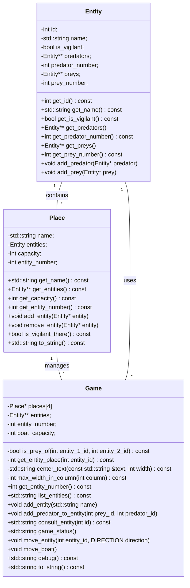

# Boat game

### Statement

The Boat Game is a puzzle where you need to transport a set of entities across a river using a boat. The boat has a limited capacity, and certain entities cannot be left together without supervision. The goal is to move all entities from the left side of the river to the right side without any entity being harmed.

### Class diagram

